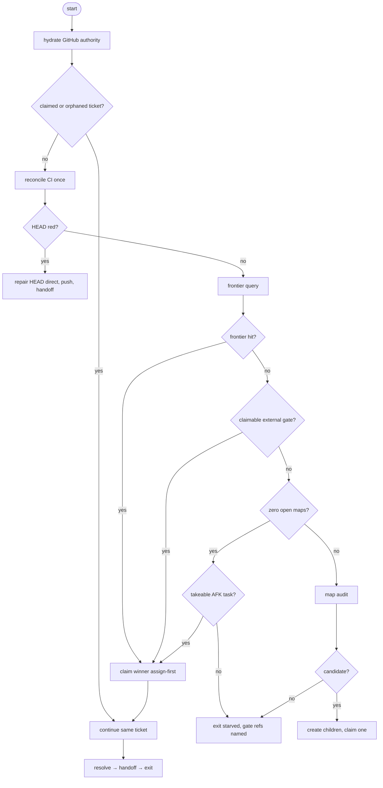

# Wayfinder session lifecycle

The full state machine for a wayfinder chain session: start, hydration,
recovery, claims, handoff. Ownership of the lifecycle surfaces:

- root `AGENTS.md` — concise cross-repo invariants + a pointer here;
- this file — the agent/session lifecycle (hydration, recovery, claims, handoffs);
- `docs/agents/wayfinder-loop.md` — daemon/operator mechanics;
- `docs/agents/issue-tracker.md` — tracker/claim/frontier operations.

## Session states

```
start → hydrate → reconcile CI (once) → claim → work → resolve → handoff → exit
          ↑__________ recovery re-enters here __________|
```

A fresh session starts from `/wayfinder <handoff>`: load the map and packet,
then follow Ticket claim order below — hydrate, reconcile CI exactly once, claim
exactly one ticket, work it to resolution, write the successor packet, exit.
A ticket may span sessions.

## Ticket claim order (start-of-loop)

Central decision flow for what a session works on. The map, the packet, and the
tracker mechanics are inputs; this section is the authoritative order. Query
mechanics (dependency wiring, priority ranks, takeability) live in
`docs/agents/issue-tracker.md` ("Wayfinding operations") and are not restated here.



1. **Hydrate** — refresh map, packet ticket, and blocker/human-decision state;
   GitHub outranks the packet ("Hydration contract" below).
2. **Continue** — the packet names an open unfinished ticket assigned to the
   driver, or the tracker shows a crash-orphaned claim: resume it; selection
   ends here, one claim per session ("Recovery" below).
3. **Reconcile CI once** — fresh starts only, never on recovery. RED HEAD →
   repair directly on master, push, handoff, stop (root `AGENTS.md`,
   "Performance").
4. **Frontier** — run the tracker frontier query; on a hit, claim the winner
   assign-first and work it ("Claim" in `docs/agents/issue-tracker.md`).
5. **Gate** — empty frontier with a claimable external blocker outside the map
   subtree: claim the nearest one; it is the session's one claim ("Frontier
   query" gate rule).
6. **Chain end** — no claimable gate and zero open maps: claim one takeable
   AFK task ("Chain-end fallback"); nothing qualifies → exit starved with gate
   refs named.
7. **Audit** — an open map stands with no claimable gate: run the map's
   required focused/full audit; on candidates create the children and claim
   exactly one; on none, record the clean audit and stop ("Session lifecycle"
   in `docs/agents/issue-tracker.md`).

## Hydration contract (map #329)

On **every** start and resume, before lifecycle-changing action, refresh the
mutable GitHub authority:

- the claimed issue's current body **and all comments**, read chronologically;
- material later corrections synthesized into the applicable issue body;
- parent-map state;
- blocker/dependency and human-decision state affecting the next action.

GitHub state outranks stale handoff text. A same-session fixture: the packet
says A, a later issue comment says B — proceed under reconciled B.

## CI reconciliation is session-start-only

Next-session check-run reconciliation (root `AGENTS.md`, "Performance") runs
once per fresh session start. Recovery nudges never rerun it, an active
agent never polls asynchronous CI, and "the daemon resumed me" is not a new
session for CI purposes. Perform only freshness checks required by the
current phase's normal continuation.

Any conclusion other than success — failure, cancelled, skipped — marks an
unverified head: nothing has checked it, so treat it as a repair-first
signal and lean on local verification before trusting master. An
owner-cancelled leg is deliberate known-red state, not an infrastructure
anomaly (#412): the head still owes verification from somewhere.

## Recovery

Interruption is not user pressure. The daemon's recovery prompt is automatic
and semantically neutral: receiving it — or receiving it repeatedly — carries
no information about time, context, or budget, and must not cause an early
handoff, a phase change, or a frontier switch. The canonical prompt text
lives once, in `tools/wayfinder/wayfinder-loop.sh` (`NUDGE`); every in-place path
posts it:

- immediate completed-stop nudge;
- stall/zombie resume;
- manual `--resume`.

Fresh spawns are not recovery: they start normally through `/wayfinder`.
Manual respawn (`--retry`) fires only after the prior session is confirmed
gone; the daemon refuses to duplicate a still-live worker.

While recovering, preserve the current ticket and phase. Continue the
claimed unfinished ticket only — do not claim or resolve another frontier
child. Creating required derivative issues stays legal (blocker,
`needs-info`, `ready-for-human`, correctness finding, architecture/enabler
graduation, follow-up); execution does not switch to them. If the claimed
ticket was already resolved before interruption, finish its resolution
comment/tracker/map updates, then hand off as the final action.

### Mid-ticket continuation (intentional)

A successor packet may name an open unfinished ticket already assigned to
the driving dev. The successor continues that ticket even though normal
frontier selection excludes assigned children — assignment by the packet is
the continuation of the same claim, not a second claim.

### Crash after claim

A worker claims a child and dies before writing a packet. Fresh recovery
reconstructs the outstanding claim from tracker/runtime state (open child +
assignee + no live opencode session on the repo) and resumes that same
child, or stops safely if ownership is ambiguous. It never silently skips
the assigned child to claim a second frontier ticket. No tracked runtime
ledger: GitHub assignment is the claim record.

## Human decisions

One contract everywhere: deferred through the tracker, never the question
tool (root `AGENTS.md`, "Human Decisions"; `docs/agents/issue-tracker.md`,
"Human decision deferral"). Record verified facts, the exact decision, why
execution is blocked, and the smallest safe next action on a `needs-info` or
`ready-for-human` issue; unclaim the blocked ticket so it stays deferred until
answered; then write the successor handoff naming that issue as the exact next
action and stop. The chain is fully AFK: a deferred ticket waits on GitHub,
never in a live session, and no session state exists for holding work open on
a human answer. The daemon's question-form detection is a defensive tripwire
for an unexpected policy-violating session — it is not the normal HITL path
and must not be documented as one.

## Handoffs and parking

Packets stay compact pointer packets (#336): active map/ticket, phase, last
integrated/verified commit, concise verification state, blockers, parked-work
reference, exact next action, durable GitHub pointers. Never copy issue
bodies, comments, map diaries, docs, or diffs into a packet. A successor
rebuilds its working set from the ticket, the owning module card
(`docs/deep-modules.md`), and code search — per
`docs/agents/context-discovery.md`; never from inherited source context.

Before any exit the worktree is clean: commit coherent slices normally
(`ref #<n>`, direct to master); park genuinely unfinished work with
`tools/wayfinder/wayfinder-park.sh <note>` and record the exact stash ref. Successors
pop only the stash their packet names — no unrelated stash is touched.

### CI-wait packets (pending verdict, zero delta)

When session-start CI reconciliation reports PENDING and the session did no
work (no commit, no tracker write owed), productive pivot beats idle hold —
never mint numbered `*-pendingN-*` packets: every new filename defeats the
daemon's fingerprint dedupe and burns a full-context worker per minute
(the map #668 / ticket #695 pending9→pending15 spin). Instead, in order:

1. **Pivot first.** Release the pending claim (remove the driver assignee so
   the ticket re-enters the pool instead of pinning the chain), record the
   awaited SHA plus its acceptance predicate in the successor packet, and
   direct the successor at exactly one pivot target taken under the normal
   claim order (chain-end fallback, then map audit). That pickup is the
   successor's one claim. The pending ticket's resolution belongs to
   whichever later session reconciles its verdict: reconcile the recorded
   awaited SHA as well as HEAD (HEAD may have moved under AFK pushes) —
   GREEN resolves it, RED repairs the named leg.
2. **Hold last.** Only when no pivot candidate qualifies, fall back to the
   canonical hold and keep the claim assigned so the woken session continues
   it:
    - If a `<!-- wayfinder-ci-wait: <full-head-sha> -->` packet for this HEAD
      already exists, stop with NO new packet — the chain rests on that hold.
    - Else write exactly one `wayfinder-<map>-<shortsha>-ciwait-handoff.md`
      packet carrying the marker and stop.

The daemon holds the spawn on that marker until hosted CI concludes
(GREEN/RED wakes exactly one session; UNKNOWN or unreachable CI proceeds),
and real progress in any newer unmarked packet preempts the wait.

After the packet is recorded and the worktree is clean, stop: hosted CI owns
broad verification asynchronously and each fresh session's start-of-session
reconciliation consumes its verdict (the daemon repair watch is disabled, ref #652)
— no local exit sweep exists (the local-CI runner is retired, ref #627).

## Negative controls

- Repeated recovery prompts never trigger an early handoff by themselves.
- A recovered session never claims/resolves a different frontier child.
- Recovery still permits creating required derivative issues.
- Manual recovery against an existing session cannot fresh-spawn a duplicate.
- Fresh respawn happens only after confirmed absence of the prior worker.
- Crash after claim resumes the same child or stops safely — never a second claim.
- Intentional mid-ticket handoff resumes the same assigned child.
- Same-session recovery rehydrates B over stale A without CI polling.
